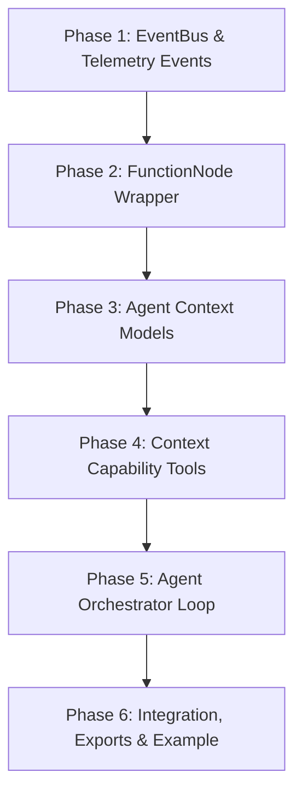

# Spec: Agent Context & Orchestration Loop

This specification outlines the architecture, integration resonance, and finalized design decisions for implementing the Agent Context objects, the `AgentOrchestrator`, and their supporting features within the `rh_cognitv` package.

---

## 1. Overview & Current Architecture

Currently, the `rh_cognitv` framework is composed of independent, low-level execution nodes:
- **LLMTextNode**: For single-shot chat completion.
- **LLMStreamNode**: For streaming completions using an async generator interface yielding `StreamEvent`s.
- **LLMStructuredNode**: For executing tool calls with schema validation.
- **LLMEmbeddingNode**: For vector embedding generation.

Pluggable provider adapters (OpenAI, Gemini) implement capability-specific abstract base classes (ABCs) to decouple the provider SDKs from the execution node classes.

### How the New Feature Resonates
We are introducing the concepts from [02_agent_context.md](../docs/02_agent_context.md) to build an agent reasoning loop (Agent Loop). 
- The **AgentOrchestrator** drives the main cycle: formatting context, running `LLMStreamNode` for output, executing tools, and running context hygiene.
- The **ActiveContext** holds the runtime state (Observations, Facts, Decisions, State, Todos) and manages its own formatting and serialization.
- **Tools/Capabilities** are integrated as uniform execution nodes (`FunctionNode`), allowing us to wrap ordinary Python functions with the same validation, metadata (duration), and error translation as LLM calls.
- Telemetry, logging, and user-facing streaming are separated via an async **EventBus** to prevent coupling the orchestrator to any single visual output mechanism.

---

## 2. Incorporating Deferred Features (from `future.md`)

We have elevated two deferred features from [future.md](../docs/future.md) into the current scope:

### Feature 1: EventBus & Observability Infrastructure
* **Why**: The orchestrator manages a complex, multi-step process that generates multiple streams of data (real-time thought deltas, tool start/end events, fact extraction, decision logging, todo updates). Rather than coupling the orchestrator to stdout printing or hardcoded callbacks, an `EventBus` provides a pub/sub system where arbitrary telemetry handlers can subscribe and consume events.

### Feature 3: FunctionNodes
* **Why**: The agent uses Python functions as tools. Wrapping these in a `FunctionNode` ensures that tool execution is subject to runtime argument validation (using Pydantic), measures execution time, and translates raw exceptions into a uniform `FunctionResult` structure. This aligns tool execution with the rest of the node-based architecture.

---

## 3. Finalized Design Decisions

### DD-A1: Data Representation of Agent Context Objects
* **Decision**: **Pydantic `BaseModel` Classes**
* **Rationale**: Since the entire library uses Pydantic for inputs, configurations, and outputs, using Pydantic models for context objects ensures type safety, runtime validation, and native nested serialization.
* **Models to Create**:
  * `Observation`: Represents tool output, file reads, or web search results.
  * `Fact`: Represents a distilled fact extracted from observations.
  * `Decision`: Represents a commitment or decision.
  * `TodoItem` & `TodoState`: Tracks tasks, current step, and completion status.
  * `RetrievalEntry`: Entries in the retrieval ledger.
  * `ActiveContext`: The central container holding the current task, plan, todo state, facts, observations, notebook entries, auto-memory, and retrieval ledger.

---

### DD-A2: Cognitive State Extraction & Streaming Parser
* **Decision**: **Native Adapter Tool-Calling & Connector Consolidation**
* **Rationale**: Rather than using fragile XML tags or regex parsing on the raw LLM text stream, we treat the agent's actions/capabilities (defined in `02_agent_context.md`) as standard Pydantic tools.
* **Mechanism**:
  1. The agent's capabilities (e.g. `todo.update`, `notebook.append`, `context.extract_facts`, `memory.propose_update`) are defined as standard `ToolDefinition`s.
  2. The LLM streams tool calls natively using provider-specific SDK streaming formats.
  3. The `LLMStreamNode` accumulator automatically reconstructs and consolidates the streamed delta fragments into full `ToolCallResult` objects.
  4. The orchestrator receives the consolidated tool calls and executes them as `FunctionNode`s. If the capability is context-related (e.g. `context.extract_facts`), the function updates the in-memory `ActiveContext`.
  5. The LLM's text stream is consumed as standard thoughts and reasoning, dispatched in real-time as `AgentThoughtDelta` events.

---

### DD-A3: Context Hygiene and Budget Policy Enforcement
* **Decision**: **Heuristic Rule-Based Pruning with Configurable Parameter $K$**
* **Rationale**: To prevent token bloat and context window overflow, the orchestrator automatically applies strict structural rules during context serialization:
  * Only keep the last $K$ raw `Observation`s (tool execution results) active in the compiled prompt. Older observations are archived.
  * Distilled `Fact`s, `Decision`s, and `Notebook` entries remain active.
  * **Configurability**: The parameter $K$ (`max_active_observations`) is defined as a parameter in both `ActiveContext` and the orchestrator's run configuration.

---

### DD-A4: Handling of Tool / Capability Exceptions
* **Decision**: **Fail-Safe (Capture and Report)**
* **Rationale**: Unhandled exceptions in wrapped tools are captured, formatted as standard error messages, and returned to the agent as tool execution observations. This lets the agent see what went wrong and attempt to self-correct. To prevent infinite loops, the orchestrator enforces a configurable `max_steps` limit.

---

### DD-A5: Orchestrator Loop Telemetry and Decoupling
* **Decision**: **Async EventBus**
* **Rationale**: The orchestrator publishes structured event models (e.g. `AgentStepStarted`, `AgentThoughtDelta`, `AgentToolCallStarted`, `AgentToolCallFinished`, `AgentStepCompleted`) to a central `EventBus`. Telemetry consumers (loggers, dashboards) subscribe independently.

---

## 4. Implementation Phases

### Phase 1: EventBus & Telemetry Events
* **Deliverable**: Create `rh_cognitv/event_bus.py`.
* **Details**: Define `EventBus` class supporting async publish and subscription. Define the structured event hierarchy (`AgentStepStarted`, `AgentThoughtDelta`, `AgentFactExtracted`, `AgentDecisionMade`, `AgentTodoUpdated`, `AgentToolCallStarted`, `AgentToolCallFinished`, `AgentStepCompleted`).

### Phase 2: FunctionNode Wrapper
* **Deliverable**: Create `rh_cognitv/nodes/function_node.py`.
* **Details**: Implement `FunctionNode` inheriting from `BaseNode`. Implement Pydantic `validate_call` integration to check sync and async function inputs. Ensure exception catching maps to `FunctionResult` structure.

### Phase 3: Agent Context Models
* **Deliverable**: Create `rh_cognitv/agents/context.py`.
* **Details**: Define Pydantic models for `Observation`, `Fact`, `Decision`, `TodoItem`, `TodoState`, `RetrievalEntry`, and `ActiveContext`. Implement the `format_prompt` method to render context into the system instructions layout matching `02_agent_context.md`. Implement structural pruning of observations using the configurable parameter $K$.

### Phase 4: Context Capability Tools
* **Deliverable**: Extend `rh_cognitv/agents/context.py` or create helper tools.
* **Details**: Define context manipulation functions (e.g. `todo_update`, `notebook_append`, `extract_facts`, `make_decision`) and wrap them as `FunctionNode`s. These functions act on the active context, allowing the agent to manage its own state using standard tool calling.

### Phase 5: Agent Orchestrator Loop
* **Deliverable**: Create `rh_cognitv/agents/orchestrator.py`.
* **Details**: Implement the `AgentOrchestrator` which:
  * Manages active context and registered tools.
  * Formats prompts and inputs `ActiveContext` into the message sequence.
  * Drives `LLMStreamNode` and processes the delta events.
  * Executes capability tool calls, capturing results and errors into `Observation`s.
  * Runs context hygiene at the end of each step.
  * Publishes detailed progress events to the `EventBus`.

### Phase 6: Integration, Exports & Example
* **Deliverable**: Update `rh_cognitv/__init__.py` and create `/app/examples/agent_reasoning.py`.
* **Details**: Export new classes (`EventBus`, `FunctionNode`, `AgentOrchestrator`, and context models). Create a runnable example script demonstrating an agent planning, executing tool calls, distilling facts, and successfully completing a multi-step task.
