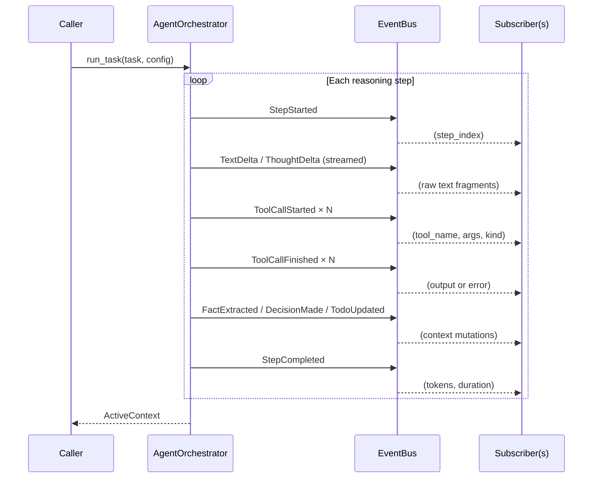
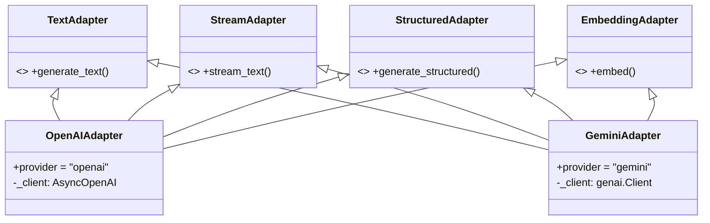
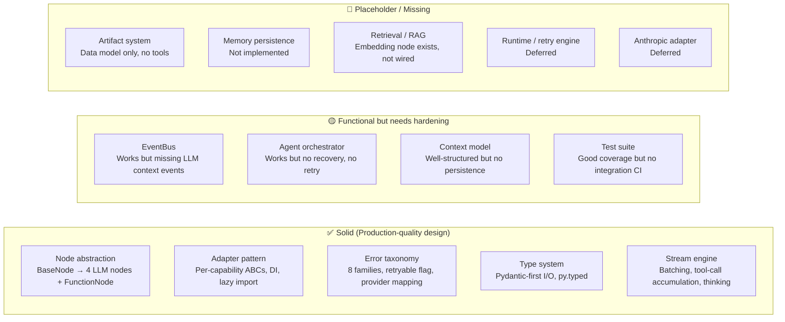

# rh_cognitv — Deep Package Analysis

> **Package**: `rh_cognitv` v0.0.0b0 · **~3,300 LOC** (source) + **~3,500 LOC** (tests)  
> **Scope**: Cognitive Skill-driven Orchestration Framework — async-first, provider-agnostic LLM nodes + agentic reasoning loop

---

## 1. EventBus as LLM Context Observability Layer

### What exists today

The [EventBus](file:///app/rh_cognitv/event_bus.py) is a lightweight async pub/sub system (~50 LOC of core logic) that provides **decoupled, real-time observability** into the agent reasoning loop. It covers:

| Event class | Fires when | LLM context visibility |
|---|---|---|
| [AgentStepStarted](file:///app/rh_cognitv/event_bus.py#L27-L31) | Each reasoning step begins | Step index |
| [AgentTextDelta](file:///app/rh_cognitv/event_bus.py#L46-L50) | Model streams regular text | Raw text fragments |
| [AgentThoughtDelta](file:///app/rh_cognitv/event_bus.py#L34-L43) | Model streams thinking/reasoning | Chain-of-thought tokens |
| [AgentToolCallStarted](file:///app/rh_cognitv/event_bus.py#L77-L84) / [Finished](file:///app/rh_cognitv/event_bus.py#L87-L96) | Tool invocation lifecycle | Tool name, args, output, error, `tool_kind` (internal/external) |
| [AgentFactExtracted](file:///app/rh_cognitv/event_bus.py#L53-L58) | Fact distilled into context | `fact_id`, content |
| [AgentDecisionMade](file:///app/rh_cognitv/event_bus.py#L61-L65) | Decision recorded | `decision_id`, content |
| [AgentTodoUpdated](file:///app/rh_cognitv/event_bus.py#L69-L74) | TODO list mutated | Goal + all steps with status |
| [AgentStepCompleted](file:///app/rh_cognitv/event_bus.py#L99-L114) | Step finishes | Token counts (prompt/completion/total), `duration_ms` |

**Subscriber model**: Type-based dispatch + wildcard `"*"`. Both sync and async handlers are supported. Async handlers are fire-and-forget via `asyncio.create_task`. Handler exceptions are silently swallowed to prevent observability from crashing the main loop.

### What you CAN see through the bus today



### What you CANNOT see (gaps)

> [!WARNING]
> **The bus does NOT expose the actual LLM prompt or the full message history sent to the provider.** This is the single biggest blind spot for "complete vision of what LLM digests."

| Gap | Impact | Severity |
|---|---|---|
| **No `AgentPromptComposed` event** | You cannot inspect the full system prompt + context window the LLM receives at each step | 🔴 Critical |
| **No `AgentMessageHistory` event** | The growing `messages: list[Message]` array is invisible to bus subscribers | 🔴 Critical |
| **No raw LLM response event** | Only text deltas are streamed; the consolidated `StreamResult` (with `raw_response`) is never published | 🟡 Medium |
| **No context-hygiene event** | When `apply_hygiene()` prunes observations, no event is emitted — pruned data vanishes silently | 🟡 Medium |
| **No classification event** | The SIMPLE/COMPLEX classification LLM call is invisible to the bus | 🟡 Medium |
| **No `AgentObservationAdded` event** | Tool results are added to `recent_observations` without a dedicated event | 🟠 Low-Medium |
| **No aggregate cost/token event** | Per-step tokens are published but there is no cumulative total across all steps | 🟠 Low |

### Recommendation to achieve "complete LLM context vision"

Add two high-value events:

```python
class AgentContextSnapshot(AgentEvent):
    """Emitted before each LLM call with the full context window."""
    type: Literal["agent_context_snapshot"] = "agent_context_snapshot"
    step_index: int
    system_prompt: str       # The rendered system prompt
    messages: list[dict]     # The full message history sent to the LLM
    tool_definitions: list[str]  # Tool names available
    context_tokens_estimate: int | None = None

class AgentContextPruned(AgentEvent):
    """Emitted when hygiene rules prune observations."""
    type: Literal["agent_context_pruned"] = "agent_context_pruned"
    pruned_observation_ids: list[str]
    remaining_count: int
```

---

## 2. Adapter State Management & Recovery

### Architecture

The adapter layer follows a **stateless, capability-based ABC composition**:



### State characteristics

| Aspect | Current behavior | Assessment |
|---|---|---|
| **Adapter internal state** | Stateless — only holds a `_client` reference. No conversation memory, no cache, no connection pool management. | ✅ Clean |
| **Client injection** | Both adapters accept an optional `client` parameter for DI/testing | ✅ Good for testing |
| **Lazy SDK import** | SDKs imported at construction time, not module level (SG-03) | ✅ Correct |
| **Error mapping** | Both adapters duck-type SDK exceptions → canonical [LLMError](file:///app/rh_cognitv/nodes/llm/errors.py#L36) hierarchy | ✅ Solid |

### Can the system recover state smoothly?

> [!IMPORTANT]
> **No.** There is no state persistence or recovery mechanism at any layer.

| Layer | State | Persistence | Recovery |
|---|---|---|---|
| [ActiveContext](file:///app/rh_cognitv/agents/context.py#L66-L82) | All cognitive state (facts, decisions, todo, observations, notebook, artifacts) | ❌ In-memory only | ❌ Lost on crash |
| [AgentOrchestrator](file:///app/rh_cognitv/agents/orchestrator.py#L65) | `messages: list[Message]` (conversation history) | ❌ Local variable in `run_task` | ❌ Lost on crash |
| Adapters | Stateless (no session state) | N/A | N/A |
| [EventBus](file:///app/rh_cognitv/event_bus.py#L117) | Subscriber registry | ❌ In-memory | ❌ Lost on restart |

**What would be needed for smooth recovery:**

1. **Checkpoint serialization** — `ActiveContext` is already a Pydantic `BaseModel`, so `context.model_dump_json()` works today. The `messages` list is also serializable. The missing piece is a persistence layer that snapshots after each step.
2. **Step-resume protocol** — `run_task` would need to accept an optional `ActiveContext` + `messages` to resume from a checkpoint rather than starting fresh.
3. **Idempotent tool execution** — Tools would need idempotency markers to avoid re-executing already-completed tool calls on resume.

> [!TIP]
> The Pydantic-first design is a hidden strength here — everything in `ActiveContext` is already serializable. Adding checkpointing is an additive change, not a refactor.

---

## 3. Context Compaction, Distillation, Storage & Tool Strategies

### 3.1 Context compaction

| Strategy | Implemented? | How |
|---|---|---|
| **Observation pruning (sliding window)** | ✅ Yes | [apply_hygiene()](file:///app/rh_cognitv/agents/context.py#L84-L92) keeps only the K most-recent observations (`max_active_observations`, default 3) |
| **Summarization of old messages** | ❌ No | The `messages` list grows unbounded across steps. No rolling summarization. |
| **Context window tracking** | ❌ No | No token counting of the composed prompt. Will eventually hit `ContextLengthError`. |
| **Selective message pruning** | ❌ No | System prompt is refreshed each step (good), but all prior assistant/user messages accumulate. |

### 3.2 Information distillation

The framework has a **deliberate two-tier distillation model** driven by the LLM itself:

```
Raw tool output → Observation (temporary, prunable)
                     ↓ (LLM calls context.extract_facts)
                  Fact (durable, persists across steps)
                     ↓ (LLM calls context.make_decision)  
                  Decision (permanent commitment)
```

| Mechanism | Tool | Location | Assessment |
|---|---|---|---|
| **Fact extraction** | [context.extract_facts](file:///app/rh_cognitv/agents/context.py#L192-L199) | Internal tool callable by LLM | ✅ Well-designed — LLM distills conclusions from raw observations |
| **Decision recording** | [context.make_decision](file:///app/rh_cognitv/agents/context.py#L201-L205) | Internal tool callable by LLM | ✅ Good — captures reasoning + commitment |
| **Notebook append** | [notebook.append](file:///app/rh_cognitv/agents/context.py#L187-L190) | Internal tool callable by LLM | ✅ Good — but no retrieval, search, or pruning |
| **Auto memory** | `auto_memory` field on [ActiveContext](file:///app/rh_cognitv/agents/context.py#L77) | Caller-injected, read-only | ⚠️ Static — never updated during execution |

> [!NOTE]
> The distillation pipeline is **LLM-directed**: the system prompt instructs the agent to call `context.extract_facts` immediately after tool use, and the observation pruning creates pressure to do so. This is a sound design — the LLM acts as its own knowledge curator.

### 3.3 Historical artifact storage & retrieval

| Capability | Status | Details |
|---|---|---|
| **Artifact list** | 🟡 Placeholder | `ActiveContext.artifacts: list[str]` exists but is never populated by any tool |
| **Artifact creation tool** | ❌ Missing | No `artifact.create` or `artifact.save` tool exists |
| **Artifact retrieval tool** | ❌ Missing | No way to read back artifacts |
| **Retrieval ledger** | 🟡 Model-only | [RetrievalEntry](file:///app/rh_cognitv/agents/context.py#L57-L63) exists in the data model but no tool populates it |
| **Embedding-based retrieval** | ❌ Missing | `LLMEmbeddingNode` exists as infrastructure but is not wired into the agent loop |
| **Long-term memory / cross-session** | ❌ Missing | No persistence layer |

### 3.4 Tool strategy inventory

**Internal (context) tools** — defined in [get_default_context_tools](file:///app/rh_cognitv/agents/context.py#L169-L213):

| Tool name | Purpose | Wired to EventBus? |
|---|---|---|
| `todo.create` | Plan decomposition | ✅ `AgentTodoUpdated` |
| `todo.update` | Progress tracking | ✅ `AgentTodoUpdated` |
| `context.extract_facts` | Distillation | ✅ `AgentFactExtracted` |
| `context.make_decision` | Commitment recording | ✅ `AgentDecisionMade` |
| `notebook.append` | Knowledge storage | ❌ No dedicated event |

**External (user-provided) tools** — registered via `action_tools` on [AgentOrchestrator](file:///app/rh_cognitv/agents/orchestrator.py#L68-L81):

- Wrapped as [FunctionNode](file:///app/rh_cognitv/nodes/function_node.py) (sync or async, Pydantic-validated args)
- Namespaced with `external.` prefix in LLM tool schema to prevent collisions
- Both `ToolCallStarted` and `ToolCallFinished` events carry `tool_kind: "internal" | "external"`

> [!IMPORTANT]
> **Missing tool capabilities that would significantly enhance the agent:**
> - `context.search_facts(query)` — search across accumulated facts
> - `artifact.create(name, content)` / `artifact.read(name)` — persistent artifact management  
> - `retrieval.log(topic, outcome, source)` — populate the retrieval ledger
> - `context.summarize()` — trigger a compaction of the message history
> - `notebook.search(query)` — retrieve from notebook by relevance

---

## 4. Overall Maturity & Hardening Path

### Maturity assessment



### Quantitative snapshot

| Metric | Value | Assessment |
|---|---|---|
| Version | `0.0.0b0` | Pre-release beta |
| Source LOC | ~3,300 | Compact, focused |
| Test LOC | ~3,500 | Excellent test-to-source ratio (~1.06:1) |
| Test files | 20 | Covers all major components |
| Providers | 2 (OpenAI, Gemini) | Sufficient to prove abstraction |
| Examples | 5 runnable scripts | Good DX |
| Dependencies | 4 core (pydantic, jsonpatch, ulid-py, jsonschema) | Minimal, well-chosen |
| Type coverage | `py.typed` markers present | Ready for downstream type checking |

### Hardening roadmap (recommended priority order)

#### Phase A — Context Integrity (High-priority, low-effort)

| # | Item | Effort | Impact |
|---|---|---|---|
| A1 | Add `AgentContextSnapshot` event (full prompt + messages before each LLM call) | S | 🔴 Critical for debugging |
| A2 | Add `AgentContextPruned` event when `apply_hygiene()` drops observations | S | 🟡 Observability |
| A3 | Add token counting to `format_context()` and emit an estimate in the snapshot | M | 🟡 Prevents silent context overflow |
| A4 | Add `notebook.append` event (`AgentNotebookUpdated`) | S | 🟢 Completeness |

#### Phase B — Context Compaction & Resilience (Medium-effort, high-value)

| # | Item | Effort | Impact |
|---|---|---|---|
| B1 | **Message summarization** — After N steps, summarize old messages into a condensed block | M | 🔴 Prevents context overflow in long tasks |
| B2 | **Checkpoint serialization** — Serialize `ActiveContext` + `messages` after each step | M | 🔴 Enables crash recovery |
| B3 | **Step-resume** — Accept optional checkpoint in `run_task()` to resume | M | 🟡 Crash recovery |
| B4 | **Retry on transient LLM errors** — Wrap `stream_text` calls with backoff | M | 🔴 Production requirement |

#### Phase C — Artifact & Retrieval System (Medium-effort, high-value)

| # | Item | Effort | Impact |
|---|---|---|---|
| C1 | Implement `artifact.create` / `artifact.read` tools wired to `ActiveContext.artifacts` | M | 🟡 Enables persistent outputs |
| C2 | Wire `LLMEmbeddingNode` into agent loop for semantic fact/notebook search | L | 🟡 RAG-based memory |
| C3 | Implement `retrieval.log` tool to populate `RetrievalEntry` ledger | S | 🟢 Completeness |
| C4 | Add `context.summarize` tool for LLM-driven compaction | M | 🟡 Long-task viability |

#### Phase D — Production Hardening (Higher-effort)

| # | Item | Effort | Impact |
|---|---|---|---|
| D1 | **Runtime/execution engine** with retry policies, timeouts, concurrency limits | L | 🔴 Production-grade |
| D2 | **Anthropic adapter** | M | 🟡 Provider coverage |
| D3 | **Multi-modal message support** | L | 🟡 Modern LLM features |
| D4 | **FlowNodes** (ForEach, MapReduce, Conditional, DAG) | XL | 🟢 Orchestration power |
| D5 | **EventBus persistence** (forward to Kafka/Redis) | M | 🟡 Audit trails |

> **Effort scale**: S = hours, M = 1-3 days, L = 1-2 weeks, XL = 2+ weeks

---

## Summary Verdict

The package has a **remarkably clean architecture for its age** — the Pydantic-first design, per-capability adapter ABCs, canonical error taxonomy, and the observation→fact→decision distillation pipeline show thoughtful design. The EventBus provides good agent-level observability but **critically lacks LLM input visibility** (what the model actually sees). The adapter layer is stateless by design (correct for adapters) but the orchestrator has **zero recovery capability** — a crash loses all context. The context compaction strategy (observation pruning) is a good start but the unbounded message history is a ticking time bomb for long tasks.

**Highest-impact next steps**: Add context snapshot events (A1), implement message summarization (B1), add checkpoint serialization (B2), and build retry logic (B4). These four items would transform the package from "impressive prototype" to "production-viable framework."
